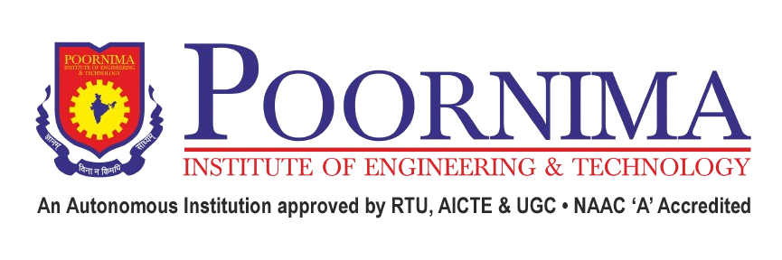

# ICRACS 2026 - Conference Website



Official website for the **International Conference on Recent Advances in Artificial Intelligence, Computer Vision & Smart Systems (ICRACS 2026)**, hosted by Poornima Institute of Engineering and Technology, Jaipur, Rajasthan.

## 🎯 About the Conference

ICRACS 2026 is the 3rd International Conference focusing on cutting-edge research and innovations in:
- **Artificial Intelligence** - Neural networks, deep learning, and machine learning applications
- **Computer Vision** - Pattern recognition, image processing, and visual systems
- **Smart Systems** - IoT applications, smart cities, and cyber-physical systems

**Conference Dates:** April 17-18, 2026  
**Location:** Poornima Institute of Engineering and Technology, Sitapura, Jaipur, Rajasthan

## 🚀 Tech Stack

This is a modern, responsive conference website built with:

- **Framework:** [Next.js 15.4.3](https://nextjs.org) (App Router)
- **Language:** TypeScript
- **Styling:** Tailwind CSS
- **UI Components:** Custom components with shadcn/ui
- **Icons:** Lucide React
- **Deployment:** Optimized for Vercel

## 📁 Project Structure

```
icracs/
├── src/
│   ├── app/                      # Next.js App Router pages
│   │   ├── page.tsx             # Home page
│   │   ├── agenda/              # Conference agenda
│   │   ├── archive/             # Previous conferences
│   │   ├── call-for-papers/     # CFP information
│   │   ├── committee/           # Organizing committee
│   │   ├── registration/        # Registration details
│   │   └── speakers/            # Keynote speakers
│   ├── components/
│   │   ├── layout/              # Navbar & Footer
│   │   ├── sections/            # Home page sections
│   │   └── ui/                  # Reusable UI components
│   └── lib/
│       └── utils.ts             # Utility functions
├── public/                       # Static assets
│   ├── highresimages/           # Conference venue images
│   ├── speakers/                # Speaker photos
│   └── publications-technical/   # Partner logos
└── ...config files
```

## 🛠️ Getting Started

### Prerequisites

- Node.js 18.x or higher
- npm, yarn, pnpm, or bun

### Installation

1. Clone the repository:
```bash
git clone <repository-url>
cd icracs
```

2. Install dependencies:
```bash
npm install
```

3. Run the development server:
```bash
npm run dev
```

4. Open [http://localhost:3000](http://localhost:3000) in your browser.

## 📜 Available Scripts

```bash
# Development
npm run dev          # Start development server

# Production
npm run build        # Build for production
npm start            # Start production server

# Code Quality
npm run lint         # Run ESLint
```

## 🎨 Key Features

- **Dynamic Hero Section** - Automated image slideshow with 9 high-resolution venue images
- **Important Dates** - Prominently displayed submission and registration deadlines
- **Responsive Design** - Mobile-first approach with seamless experience across all devices
- **About Sections** - Detailed information about ICRACS and PIET
- **Committee Pages** - Comprehensive list of organizing committee members
- **Call for Papers** - Research tracks and submission guidelines
- **Registration System** - Fee structure and registration process
- **Speakers Section** - Keynote speakers and their profiles
- **Publication Partners** - IEEE and other publication partners

## 🌐 Pages Overview

- **/** - Home page with hero section, about information, and key focus areas
- **/agenda** - Conference schedule and program details
- **/archive** - Information about previous ICRACS editions
- **/call-for-papers** - Research tracks, topics, and submission guidelines
- **/committee** - Honorary chairs, general chairs, and organizing committee
- **/registration** - Fee structure, payment details, and registration process
- **/speakers** - Keynote speakers and their biographical information

## 🎨 Customization

### Updating Conference Dates
Edit dates in `src/components/sections/hero-section.tsx`

### Adding Committee Members
Update the committee data in `src/app/committee/page.tsx`

### Modifying Research Tracks
Edit tracks in `src/app/call-for-papers/page.tsx`

### Changing Images
Replace images in `public/highresimages/` directory

## 📦 Build for Production

```bash
npm run build
```

The build command:
1. Runs ESLint checks
2. Validates TypeScript types
3. Generates optimized static pages
4. Creates production-ready bundle

## 🚀 Deployment

### Deploy on Vercel (Recommended)

[](https://vercel.com/new)

1. Push your code to GitHub
2. Import project in Vercel
3. Deploy automatically

### Alternative Deployment

This Next.js app can be deployed to any platform that supports Node.js:
- Netlify
- AWS Amplify
- Google Cloud Run
- Railway
- DigitalOcean App Platform

## 🤝 Contributing

If you're part of the organizing committee and need to make updates:

1. Create a new branch
2. Make your changes
3. Test locally with `npm run dev`
4. Run `npm run build` to ensure no errors
5. Submit a pull request

## 📝 License

This project is created for ICRACS 2026 conference hosted by Poornima Institute of Engineering and Technology.

## 📧 Contact

For website issues or updates, please contact the technical team at PIET.

---

**Conference Website:** [ICRACS 2026](https://icracs.poornima.org)  
**Host Institution:** Poornima Institute of Engineering and Technology  
**Location:** Sitapura, Jaipur, Rajasthan, India
